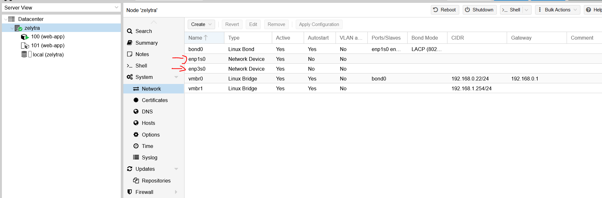

# proxmox-tutorial

***

## Sommaire

- Augmentation du stoquage de proxmox
- Configuration reseau
- Declanchementde port d'une VM/Container
- Configuration SSH

***
## Augmentation du stoquage de proxmox

***
## Configuration reseau (IP Table)
> **Warning**: ATTENTION, cette partie est critique, toutes mauvaises manipulaion peut mettre par terre la configuration reseau du serveur. Le seul moyen de reparer une erreur critique sera de se connecter en physique au serveur afin d'effectuer les corrections d'erreurs

Example de configuration classique de l'ip table de la node (`/etc/networks/interfaces`):

```properties
auto lo
iface lo inet loopback

#Carte reseau 1
auto [id_carte_reseau1] 
iface [id_carte_reseau1] inet manual

#Carte reseau 2
auto [id_carte_reseau2] 
iface [id_carte_reseau2] inet manual

# Configuration du rebond des cartes reseaux
auto bond0
iface bond0 inet manual
        bond-slaves [id_carte_reseau1] [id_carte_reseau2] #Liste des cartes reseaux 
        bond-miimon 100
        bond-mode 802.3ad
        bond-xmit-hash-policy layer3+4

# Configuration du reseau local de la machine
auto vmbr0
iface vmbr0 inet static
        address [IP_LOCAL_DU_SERVEUR]/24
        gateway [IP_DU_ROUTER_RESEAU]
        bridge-ports bond0
        bridge-stp off
        bridge-fd 0

# Configuration du reseau virtuel des VM/Container
auto vmbr1
iface vmbr1 inet static
        address 192.168.1.254/24
        netmask 255.255.255.0
        bridge-ports none
        bridge-stp off
        bridge-fd 0
        post-up echo 1 > /proc/sys/net/ipv4/ip_forward
        post-up iptables -t nat -A POSTROUTING -s 192.168.1.0/24 -o vmbr0 -j MASQUERADE
        post-down iptables -t nat -D POSTROUTING -s 192.168.1.0/24 -o vmbr0 -j MASQUERADE
```
Les ID des cartes reseaus sont trouvable dans l'onglet node/System/Network:


Afin d'appliquer la modification reloader la configuration via `ifreload -a`  

Lors de la creation d'une VM/Container toujours attribuer une IP virtuel unique au format `192.168.1.[ID_VM/CONTAINER]`.
***
## Declanchement de port d'une VM/Container

Une fois une IP assigné a la VM/Container, il faut maintenant ouvrir les ports que l'on souhaite exposer. Pour ce faire
editer de nouveaux l'ip table (`/etc/networks/interfaces`) en ajoutant a l'interface vmbr1 :
```properties
        #[ID] [Fonction de la machine]
        post-up iptables -t nat -A PREROUTING -i vmbr0 -p tcp --dport [PORT_TO_EXPOSE] -j DNAT --to 192.168.1.[IP_VMBR1_MACHINE]:[PORT_TO_REDIRECT] #[Fonction du port]
        post-down iptables -t nat -D PREROUTING -i vmbr0 -p tcp --dport [PORT_TO_EXPOSE] -j DNAT --to 192.168.1.[IP_VMBR1_MACHINE]:[PORT_TO_REDIRECT]
```

Cet ajout permet de preciser a la machine de rediriger les packet recu du port exposé vers la bonne VM/Conteneur vrs le bon port. Example de configuration :
```properties
        #101 nodejs
        post-up iptables -t nat -A PREROUTING -i vmbr0 -p tcp --dport 24 -j DNAT --to 192.168.1.101:22 #ssh
        post-down iptables -t nat -D PREROUTING -i vmbr0 -p tcp --dport 24 -j DNAT --to 192.168.1.101:22
```
Cette configuration redirige tout les packet provenant de l'ip de la machine depuis le port 24 vers la VM/Conteneur avec l'ip 192.168.1.101 vers le port 22 étant ici le serveur ssh de la vm.  

Afin d'appliquer la modification reloader la configuration via `ifreload -a` et redemarer les VM/Conteneur concernés par les modifications apporté.  

***
## Configuration SSH des VM/Conteneur
Par defaut l'accès SSH d'un serveur bloque la connexion de l'utilisateur root provenant de l'exterieur. Pour changer cela il faut:
1. `systemctl enable ssh` : Active le serveur SSH
2. `nano /etc/ssh/sshd_config` : Editer le fichier de configuration
3. `PermitRootLogin yes` : Changer la valeur de la configuration `PermitRootLogin` par `yes`
4. `systemctl restart ssh` : Redemarer le serveur ssh
5. `systemctl status ssh` : Vérifier l'état du serveur ssh afin de s'assurer que tout fonctionne correctement